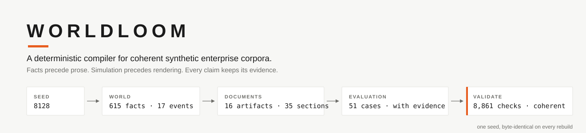
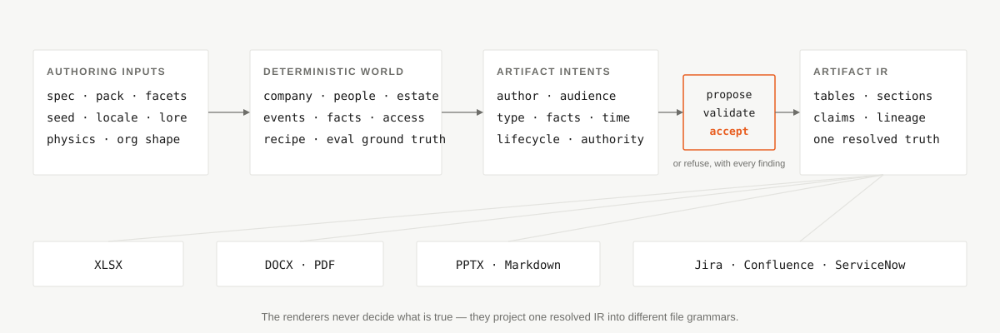
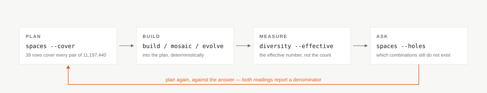

<div align="center">
<picture>
  <source media="(prefers-color-scheme: dark)" srcset="assets/readme/hero.svg">
  
</picture>

[](https://github.com/vamsiramakrishnan/synthetic-foundry/actions/workflows/ci.yml)
[](https://github.com/vamsiramakrishnan/synthetic-foundry/actions/workflows/determinism-sweep.yml)
[](https://vamsiramakrishnan.github.io/synthetic-foundry/)
[](LICENSE)

<!-- No PyPI or python-versions badge: `worldloom` is not published on PyPI
     (checked 2026-08 — the name 404s), and a badge that renders as a broken
     image is worse than none. Add them with the first release. -->

[Quickstart](#-quickstart) · [The design](#-the-design-in-one-diagram) · [Four verticals](#-four-verticals) · [The fleet loop](#%EF%B8%8F-plan-build-measure-ask) · [Agent handshake](#-production-prose-a-checked-agent-handshake) · [SDK](#-python-sdk) · [Docs site](https://vamsiramakrishnan.github.io/synthetic-foundry/)

**Status:** pre-release, installed from a clone · 3,086 test functions · four verticals · every build byte-identical on replay · Apache-2.0

</div>

Most synthetic-data systems generate files independently. The documents look
plausible one at a time and fail as a corpus: the PDF reports a total the
workbook cannot reconcile, the RCA names a cause no incident record
established, the ticket is assigned to an employee who does not exist, and the
retriever is scored against questions whose evidence was never generated.

**Worldloom generates the enterprise before it generates the files.**

| | |
|---|---|
| **615 → 16 → 8,861** | facts → documents → coherence checks, from one default seed |
| **58 → 744** | facts per period after reachability closed the thin-corpus gap (banking) |
| **11,197,440 → 39** | configurations exhaustive → covering rows that reach every pair |
| **zero** | model calls inside the library — no service, no API key, no hidden judgement |

What that buys you:

- **Every file agrees with every other file.** A memo, workbook, incident,
  ticket, board summary and retrieval answer all check against the same fact
  ledger — coherence is validated, not prompted for.
- **Ground truth is generated with the evidence.** Evaluation cases carry
  expected fact IDs, required artifacts, distractors, temporal cutoffs and
  abstention labels, derived from the same state as the documents.
- **The same seed returns the same bytes.** A corpus rebuilds from its seed,
  recipe and generation ledger, byte-for-byte, offline. CI proves it nightly
  on a rotating dispersed sample.
- **Refusal is a feature.** A flag either acts or refuses with the reason. An
  impossible company, an unreachable episode, a claim outside its evidence —
  each is refused naming the rule, never silently absorbed.
- **Your agent supplies judgement and language.** Worldloom supplies truth,
  structure, lineage and refusal, over a shell-and-JSON handshake any coding
  agent can drive.

Every number in this README is reproducible from a command on this page or a
test in [`tests/`](tests/).

## 🧭 The design in one diagram

<div align="center">
<picture>
  <source media="(prefers-color-scheme: dark)" srcset="assets/readme/flow.svg">
  
</picture>
</div>

Facts precede prose. Simulation precedes rendering. The renderers never decide
what is true: they receive one resolved `ArtifactIR` and project it into
different file grammars, which is why the PDF and the DOCX share the same
title, author, period, evidence and numbers without coordinating.

```text
world state --> events --> canonical facts --> artifact plan --> prose --> files
```

## ⚡ Quickstart

From zero to a complete, validated corpus (PyPI release pending, so install
from the clone):

```bash
git clone https://github.com/vamsiramakrishnan/synthetic-foundry.git
cd synthetic-foundry
pip install -e ".[all]"     # the library imports no LLM SDK
worldloom doctor            # every check names its fix; exit 0 means go

worldloom build --seed 8128 --incident --narrate --out ./corpus
worldloom validate ./corpus
```

Real output, not a mockup — the numbers in the hero are this run's:

```
              Ardent Holdings
 Industry                Omnichannel retail
 Headquarters              Perth, Australia
 Employees (stated)                  80,000
 Business units                           3
 Sites                                  160
 Events                                  17
 Facts                                  615
 Artifacts (rendered)                    16
 Evaluation cases                        51
 Narrated sections                       35
 Seed                                  8128

✓ coherent — 8,861 checks passed
```

Then materialise and measure:

```bash
worldloom render ./corpus -f xlsx -f docx -f pptx -f pdf -f markdown \
                          -f jira -f confluence -f servicenow
worldloom evaluate ./corpus --retriever both
worldloom status ./corpus        # where you are, and the exact next command
```

The built-in deterministic narrator is for tests, replay and inspection. For
production prose, a coding agent drives the validated
[`narrate requests` / `narrate accept` handshake](#-production-prose-a-checked-agent-handshake)
below. Independent readings — `worldloom topology`, `worldloom series`,
`worldloom diversity --near-duplicates` — each answer one question about what
came out.

## 🔒 The core invariants

> The model never owns arithmetic, identity, chronology, or graph mutation.
> Every claim has evidence, every artifact has provenance, and a rebuild from
> the recipe is byte-identical.

- **Facts precede prose** *(enforced)*: prose that contradicts the ledger is
  refused with the violation named; the corpus is never edited to fit a
  sentence.
- **Determinism without freezing** *(enforced)*: replay re-executes the recipe
  and proves the same inputs produce the same world — no golden files, no
  clock, no `random`, no UUID anywhere in the pipeline.
- **Cohesion is a compiler contract** *(enforced)*: an undeclared artifact
  type, an impossible author, an empty audience, a title unrelated to its
  family, or content escaping its declared fact scope is refused at compile
  time and stamped `artifact-contract@1` when accepted.
- **Planned accidents only** *(enforced)*: mess is ledgered. A stale page, a
  pasted-over formula, a SUM that stops a row short — each is recorded in
  `intentional-errors.jsonl` and substantiated by the validator, so a reader
  holding only the corpus can establish mechanically what is wrong and what
  the current position is.

## 🏭 Four verticals

| Vertical | Episode | What makes it useful |
| --- | --- | --- |
| Retail | `MonthEndClose` | Financial reconciliation, operational incidents, multi-period histories, workforce and estate trajectories |
| Banking | `QuarterlyCapitalReturn` | Second-line challenge, equal-authority conflict, filing and restatement |
| Insurance | `QuarterlyReserving` | Triangle development, emergence, held versus central estimates, authority-sensitive answers |
| Procurement | `PurchaseToPayCycle` | Purchase-to-pay controls, three-way matching, stock-flow identities, carried shortfalls |

The vertical owns the causal episode, its fact kinds, documents, invariants
and benchmark. A pack changes the company using an existing episode; a new
vertical changes what happens — and is authored through registration seams
without editing core (`/worldloom-vertical`).

### Volume comes from the organisation being load-bearing

A company declares business units, sites, cost centres and categories; whether
anything *reports* on them is a separate question, and for three of the four
verticals the answer used to be no. A bank with three divisions and 133
branches mentioned none of them in any document — 58 facts about capital
ratios, and every check passing, because coherence and thinness are different
properties. `validate.reachability` asks the question directly, and closing it
is where the volume came from:

| Vertical | Facts, one period | Documents | `validate` checks |
| --- | --- | --- | --- |
| Retail | 588 | 7 | 7,787 |
| Banking | 58 → **744** | 11 → **12** | 1,661 → **9,249** |
| Insurance | 62 → **219** | 4 → **8** | 1,155 → **3,088** |
| Procurement | 52 → **217** | 6 → **7** | 1,090 → **3,332** |

Every split goes through a largest-remainder allocator, so roll-ups reconcile
exactly rather than nearly, and a rate is never summed. Volume scales with the
estate rather than with a multiplier — banking at `--periods 3` mints 2,220
facts and validates at 27,001 checks.

## 🧬 Structure is derived, not looked up

A document's outline used to be a constant per artifact type: a corpus of a
thousand documents rendered a few dozen shapes, and a retriever can learn the
shape instead of the content. The outline is now a function of a **structural
genome** — integers recorded on the recipe, so a rebuild reproduces the same
shapes.

```bash
worldloom build --section-omission 400 --variant-bias 1 --outline-synthesis 600 --out ./corpus
worldloom diversity ./corpus --effective
```

`--outline-synthesis` *draws* a shape from what this company's own document
types have in common — projected onto the roles sections play, not the words
in their headings — and it is recombination, never inflation: a synthesised
outline must carry at least what the authored one carried, in no more
sections. Measured on a six-period retail corpus: 40 distinct rendered shapes
become 62 with no document losing a line of prose. `--effective` reports the
Vendi score — the *effective* number of shapes, which is where monotony hides
from a plain count.

## 🗺️ Plan, build, measure, ask

<div align="center">
<picture>
  <source media="(prefers-color-scheme: dark)" srcset="assets/readme/loop.svg">
  
</picture>
</div>

```bash
worldloom spaces --cover -t 2 > plan.jsonl    # what should exist
worldloom mosaic -n 20 --incident --out ./m   # dispersed, sharded, resumable
worldloom diversity ./m/world-01 --effective  # is it actually varied
worldloom spaces --holes plan.jsonl           # what still does not exist
```

Thirteen axes, 11,197,440 configurations exhaustive, 39 covering rows —
because a covering array grows with the two widest axes, not with the space.
The complement is the part that pays: pointed at the shipped determinism gate,
`--holes` reported it covered 24% of pairs and had **never once built a bank
running more than one period** — a gap the gate could not see, because a
sampler knows where its points landed, not which combinations nobody reached.

The loop closes with selection and evolution, all deterministic:

| Command | Question it answers |
|---|---|
| `worldloom fleet qualify ./m --purpose challenge` | does this fleet cohere, replay, and hold its floors — exit 1 if not |
| `worldloom fleet curate ./m --purpose challenge` | one champion per structural niche, every reject named with its displacer |
| `worldloom mutate ./corpus --set steps/0/trend_pct=0.008 --out mutant.json` | a recipe patched without a build — fan out candidates, spend builds on winners |
| `worldloom twin ./corpus --set steps/0/trend_pct=0.008` | the counterfactual one intervention away, delta measured stream by stream |
| `worldloom evolve --generations 3 --population 6 --purpose challenge --out ./evolved` | generations of single-axis variations, champions chosen by the curator |
| `worldloom search ./corpus "operational incident" -k 3` | what the corpus already says — the same BM25 the benchmark's baseline uses |

Not a token is spent anywhere in that table: the harness writes prose only for
the corpus that survived selection.

## 🤝 Production prose: a checked agent handshake

Worldloom deliberately imports no LLM SDK. Any agent that can execute a
terminal and exchange JSON can narrate a corpus:

```bash
worldloom narrate requests ./corpus -o requests.json
# The agent writes responses.json.
worldloom narrate accept ./corpus --from responses.json --model-id enterprise-writer-v1
```

Each request carries the artifact type, section, author and voice, audience,
knowledge cutoff, target length, allowed and required facts, and claims that
must not be made. Acceptance is transactional — every applicable rule is
checked, violations return as data, and invalid prose is never committed:

```text
request
  |
  +--> author worked here at this time?
  +--> author allowed to own this department's artifact?
  +--> audience permits the author and intended readers?
  +--> every cited fact inside the declared scope?
  +--> fact existed before the document's knowledge cutoff?
  +--> every numeric claim expressed as a fact reference?
  |
  +--> accept and ledger it, or refuse with every finding
```

Expect rejection on the first pass. **Rejection is the harness working, not
failing** — the loop repeats until every section is accepted, and the most
common violation by far is a figure typed out instead of referenced as
`{{fact:ID}}`.

Before writing a document that leans on earlier ones, ask the corpus what it
already says: `worldloom search` ranks its passages through the same index the
benchmark's baseline retriever will be scored on, and `--as-of` restricts
retrieval to what existed at the author's knowledge cutoff.

## 📈 Enterprise-scale history

Workforce size is authoritative aggregate scale; named employees are the
bounded decision-making graph — a large-company corpus without one Python
object per payroll record. Units, sites, systems and services carry half-open
lifecycles: they grow and contract across a timeline while historical
artifacts keep their original referents.

```bash
worldloom build --seed 8128 \
  --employees 80000 --headcount-end 92000 \
  --periods 6 --timeline steady \
  --estate large --sites-end 240 --systems-end 24 \
  --eval-density high --narrate --out ./enterprise
```

Every intermediate target is deterministic; each movement emits count and
delta facts, an enterprise notice, and a replayable recipe step. Contraction
closes a lifecycle window instead of deleting the entity, and targets below
dependency-safe floors are refused. Scope is stated, not simulated: histories
are multi-period retail capabilities; banking and procurement run consecutive
periods (validating at 27,001 and 9,398 checks at `--periods 3`); insurance
declares `max_periods=1` and `--periods 2` is refused at plan time naming the
cap. No flag is silently ignored.

## 🐍 Python SDK

The CLI is a set of fixed pipelines. The moment the ask is a comprehension —
fields of worlds, sweeps, filters on what came out — write Python:

```python
from worldloom import sdk

base = sdk.company("retail", seed=8128).staff(80_000).located("australia").estate("large")
candidates = sdk.cross(base, calendar=["flat", "harvest"], org=[
    {"headcount": 24, "span": 4, "levels": 3},
    {"headcount": 45, "span": 6, "levels": 4},
])
field = sdk.dispersed(candidates, 4)           # the 4 least alike
worlds = [b.build().episodes("2026-01", periods=3) for b in field]

kept = [w for w in worlds if w.ok and w.measure()["chokepoints"] > 0]
hits = kept[0].search("stock loss variance", limit=3)      # the corpus, asked about itself
mutant = kept[0].mutated({"steps/0/trend_pct": 0.008})     # recipe patched, rebuilt in memory
delta = kept[0].twin("steps/0/trend_pct", 0.008).manifest  # the measured counterfactual
```

Blueprints are immutable values; `build()` is the only operation that mints a
world; no combinator relaxes an invariant. `sdk.as_fleet(worlds, "./fleet")`
hands a loop's worlds to the same admission controller the CLI uses. See the
[Python SDK guide](docs/sdk.md).

## 🧰 Agent skills

The repository ships a progressively disclosed agent interface under
`.claude/` — a slim always-loaded core per skill, references loaded when the
work reaches them, and spec skeletons as assets verified against their real
parsers:

| Entry point | Use it for |
| --- | --- |
| `/worldloom-design` | an open-ended corpus ask, design through delivery |
| `/worldloom-build` · `/worldloom-narrate` · `/worldloom-render` · `/worldloom-evaluate` | one stage each |
| `/worldloom-act` | drive an actor episode one employee decision at a time |
| `/worldloom-company` · `/worldloom-probe` | describe the business, or derive it Socratically |
| `/worldloom-lob` · `/worldloom-process` · `/worldloom-doctypes` | author a capability, a process, a document type |
| `/worldloom-vertical` · `/worldloom-author` · `/worldloom-sdk` | a new industry, the whole cascade, or Python |

All of them use the same cascade — propose, receive every finding, revise,
accept — and none depends on a Claude-specific runtime: other harnesses start
at [AGENTS.md](AGENTS.md), and every workflow is shell plus JSON.

## 💾 Corpus anatomy

```text
corpus/
|-- world.json                    company, entities, recipe, schema version
|-- lore.jsonl                    historical priors and constraints
|-- events.jsonl                  append-only enterprise events
|-- facts.jsonl                   canonical and superseded facts
|-- artifact-intents.jsonl        type, author, audience, facts, lineage
|-- artifact-ir.jsonl             resolved tables and narrative sections
|-- artifact-manifest.jsonl       rendered files and provenance
|-- evals.jsonl                   questions, evidence, distractors, cutoffs
|-- intentional-errors.jsonl      labelled, mechanically explainable mess
|-- generation-ledger.jsonl       content-addressed generative decisions
|-- detail.jsonl / masterdata.json  transaction tables and reference data, when requested
|-- actor-*.jsonl                 observations, messages, tasks, tool calls
`-- artifacts/                    XLSX, DOCX, PDF, PPTX, Markdown, bundles
```

All ledgers are ordinary JSONL. Native artifacts are optional projections;
the canonical state stays inspectable with no renderer dependency installed.

## 🔁 Determinism and replay

```bash
worldloom build --seed 8128 --incident --narrate -f xlsx -f markdown --out ./one
worldloom build --seed 8128 --incident --replay ./one -f xlsx -f markdown --out ./two
diff -r ./one ./two          # exits 0
```

The second build consumes the first corpus's content-addressed generation
ledger and makes no generative call. Determinism is not implemented by
freezing outputs — the system re-executes the recipe and proves that the same
inputs produce the same world. CI exercises exact byte identity over a
rotating dispersed sample of configurations, nightly, on Linux and macOS.

The same proof as one verb, on any unrendered corpus:

```bash
worldloom build --seed 8128 --incident --narrate --out ./one
worldloom verify ./one       # rebuild from its own recipe, byte-compare, validate
```

## 📊 Evaluation is generated with the evidence

```bash
worldloom evals export ./corpus --out ./evals.jsonl
worldloom evaluate ./corpus --retriever both --json
worldloom stats ./corpus --json
```

Each world creates its own evaluation set from canonical facts: expected fact
IDs, required artifacts, explicit distractors, temporal cutoffs, abstention
expectations, and multi-hop families — causal chains over the event graph and
derivation-lineage chains over the value-provenance graph (a real 9-hop chain
per period on the P2P spec). BM25 and TF-IDF are deliberately modest
baselines: the useful signal is the score *shape*. Direct lookup should be
easier than temporal state, contested authority, causal chains and abstention
— a baseline that rises without improving means the corpus got easier.

## 📚 Documentation

The docs site is live at
**[vamsiramakrishnan.github.io/synthetic-foundry](https://vamsiramakrishnan.github.io/synthetic-foundry/)** —
including [`llms.txt`](https://vamsiramakrishnan.github.io/synthetic-foundry/llms.txt)
and [`llms-full.txt`](https://vamsiramakrishnan.github.io/synthetic-foundry/llms-full.txt)
for agents. In-repo, start at the [documentation home](docs/README.md):

| Guide | Purpose |
| --- | --- |
| [Architecture and invariants](docs/architecture.md) | thin waist, generation boundary, cohesion, lineage, replay, validation |
| [Enterprise corpus generation](docs/enterprise-corpus.md) | scale model, histories, sharding, resume, narration, quality gates |
| [Python SDK](docs/sdk.md) | blueprints, combinators, scenarios, measurements, rendering |
| [Agent skills](docs/skills.md) | stage commands, specialist skills, harness-neutral operation |
| [Generated command reference](.claude/skills/worldloom/references/commands.md) | every CLI command and option, derived from Typer, checked in CI |
| [Generation model](docs/generation-model.md) | which decisions are deterministic, which belong to an author |
| [Artifact compiler](docs/artifact-compiler.md) | components, grammars, style genomes, diversity, renderer constraints |
| [Episode grammar](docs/episode-grammar.md) | facts, phases, slots, carry-forward, lints, authored processes |
| [Build order](docs/build-order.md) | historical decisions, sequencing, release gates |

## 🛠️ Developing Worldloom

```bash
git clone https://github.com/vamsiramakrishnan/synthetic-foundry.git
cd synthetic-foundry
pip install -e ".[dev]"

pytest -q                        # 3,086 test functions
worldloom validate retail-close  # the pinned example corpus: 1,283 checks
worldloom docs --check           # the generated command reference is current
```

The top-level model stays small and typed. Generators own deterministic
state; scenarios append events and facts; artifact compilers consume intents;
renderers consume IR; validators stay independent of the code that produced
the data. Read [AGENTS.md](AGENTS.md) before changing the harness — it states
the invariants, the agent protocol, and the exit gates.

## 🤲 Contributing

[CONTRIBUTING.md](CONTRIBUTING.md) has the house rules — the short version is
that both gates above must pass, CI additionally regenerates a corpus from its
own ledger and diffs it byte-for-byte, and a rejection from the validator is
fixed in the prose, never in the check. Security reports go through
[SECURITY.md](SECURITY.md).

## 📜 Principles

1. Reality is generated once; artifacts are rendered many times.
2. The model never owns arithmetic, identity, chronology, or graph mutation.
3. Every claim has evidence and every artifact has provenance.
4. Refusal is a product feature, not an exceptional path.
5. Diversity is measured across a batch, not inferred from prompt variation.
6. Replay is offline and byte-identical.
7. Scale may change throughput; it may not change semantics.

Apache License 2.0. See [LICENSE](LICENSE).
