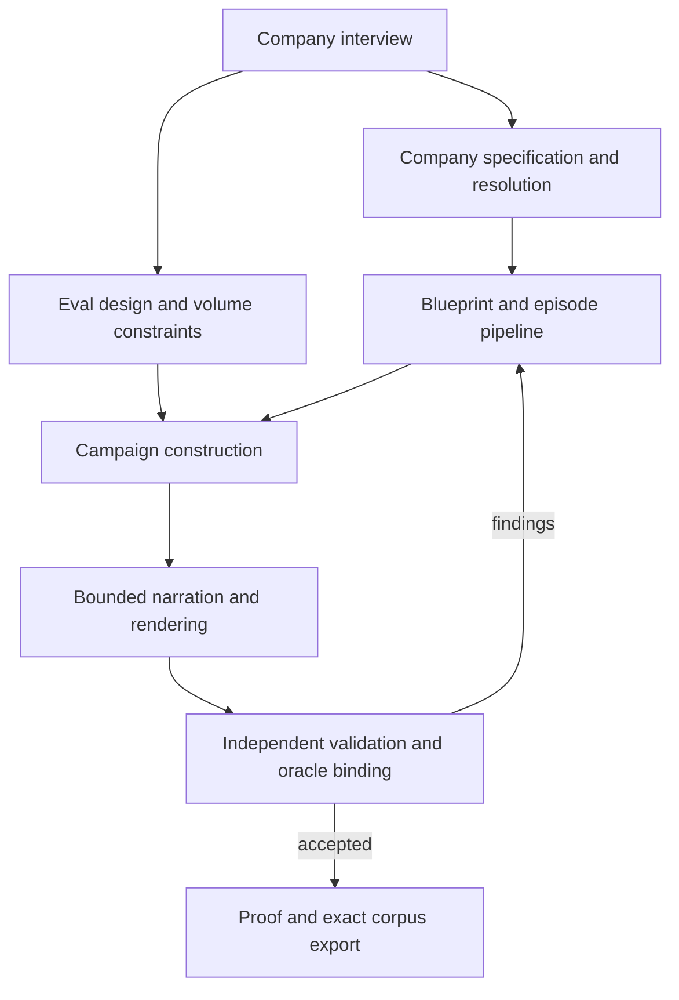

# Reusing Worldloom for company-driven evaluation campaigns

The company interview and iteration loop compose the existing `company`,
`pipeline`, and `evals` APIs. Episodes own the business mechanisms that produce
facts, events and document intents. They do not own the interview, candidate
selection, model transport, or benchmark acceptance.

This is a reuse audit and implemented path, not an estimate that a percentage
of the product is complete. Ten substantial subsystems already exist. Most of
the work needed here is connecting their contracts and correcting places where
information or validation was lost.

## What exists, and how it is reused

| Responsibility | Existing implementation | Reuse decision |
| --- | --- | --- |
| Company interview output | `company.CompanySpec`, `resolve`, `sdk.from_resolution` | Keep one company document; retain conflicts and `unmet` findings. |
| Business authoring | `cascade`, `process`, `process_planning`, `episodes`, `packs` | Reuse bounded authoring and domain episode execution. No second episode grammar. |
| Orchestration | `pipeline.Pipeline`, typed `Stage`s, `sdk.Blueprint` | `evals.candidate_builder` applies the candidate seed to an existing blueprint and runs these stages. |
| Eval design and construction | `evals.EvalCampaign`, demand compiler, tactics, witness recipe verbs | Reuse the eval-first path; do not introduce a competing campaigns package. |
| Independent acceptance | `eval_candidates.validate_candidate`, World validation | Check declared shape against observed records/artifacts/threads. Unsupported constraints explicitly fail acceptance. |
| Document structure | `documents`, `compiler` and `ArtifactIR` | Business facts precede document plans; plans precede prose. |
| Narration | `narrative.requests`, `handshake`, `claims`, `compiler`, `programs` | Reuse requests, accepted programs, retry, ledger and replay. Tighten visibility and contract identity. |
| Calibration | `calibrate.PriorSnapshot`, provider `Receipt`, `Blueprint.priors` | Preserve the source receipt alongside resolved physics, including during replay. |
| Search and diversity | `eval_search`, `outcomes`, `evolve`, `archive` | `EvalCampaign.search` exposes existing feedback; `CampaignRun.select` retains audit history while choosing outputs. Larger fleet evolution stays in its current subsystem. |
| Execution and replay | connector emulator, `eval_reference`, `recipe.rebuild`, corpus byte comparison | Prove and export the actual finalized worlds without rebuilding or reauthoring them. |

There are two eval models with different jobs: `episodes.EvalSpec` authors an
episode's built-in retrieval questions; `worldloom.evals.EvalSpec` specifies a
campaign before data exists. Do not substitute one for the other because the
names match.

## The ownership boundary



The interview asks for company identity and scale, industry and geography,
actual business processes, connector entities, per-entity volumes, task
outcomes, permissions, temporal relationships, and which uncertainty has
measured support. Company attributes go into `CompanySpec`; connector
requirements and volume constraints go into the campaign design. An employee
count is not a ticket count. A requested count is not observed evidence.

Unsupported industry behavior must be authored through the existing process
and episode seams. A connector label or an interview answer does not make a
new business engine executable. Resolve the company before spending on
narration, and retain the resolution's `unmet` list with the run.

Skills guide this interview and authoring. An SDK adapter or ACP integration,
if required by the calling harness, belongs outside the generation core. It
must return proposals or narrative responses through the same contracts;
transport choice must not create another truth store or acceptance rule.

## The composed Python path

This example uses a scripted provider to verify plumbing. It does not measure
human-quality writing. A production caller supplies its existing authoring
adapter at the same narration seam.

```python
from worldloom import company, sdk
from worldloom.evals import (
    EvalCampaign, EvalSpec, EvalStepSpec, RequirementKind,
    WorldRequirement, candidate_builder, emulator_executor,
)
from worldloom.narrative.providers import DeterministicProvider
from worldloom.pipeline import standard_pipeline

resolution = company.resolve(company.from_document({
    "engine": "banking", "geo": "united_kingdom",
}))
resolution.raise_for_conflicts()
# Inspect and retain resolution.unmet before accepting the company profile.
blueprint = sdk.from_resolution(resolution)
# If measured priors exist: blueprint = blueprint.priors(snapshot)

spec = EvalSpec(
    id="company-incident-review",
    capability="incident_retrieval",
    persona="operations manager",
    request_template="Find the incident requiring a review.",
    steps=(EvalStepSpec(id="find", capability="search", connector="servicenow",
                        entity="incident", operation="search"),),
    requirements=(
        WorldRequirement(id="facts", kind=RequirementKind.FACT),
        WorldRequirement(id="incident", kind=RequirementKind.CONNECTOR,
            selector={"connector": "servicenow", "entity": "incident",
                      "priority": "1", "state": "New"}),
    ),
    candidate_count=2,
)
campaign = EvalCampaign(spec)
builder = candidate_builder(blueprint, standard_pipeline(
    "2026-03", compile_artifacts=False, validate=False,
))
run = campaign.construct(builder)
# Construction still runs independent World, requirement and shape validation.
provider = DeterministicProvider()
final = run.map_worlds(lambda world: world.narrate(provider).render("markdown"))
chosen = final.select(1)
proofs = chosen.prove(emulator_executor())
assert all(proof.status.value == "proven_executable" for proof in proofs)
chosen.export("./campaign")
```

`map_worlds` transforms every attempted world, revalidates it and rebinds
accepted instances. It preserves construction findings and explicit selection.
`select` retains all attempts for audit; `selected` identifies output candidates.
Proof and export on the completed run never invoke the builder again. Render
before proof when formats affect the records that will be executed against.
Supplying `formats` directly to export revalidates the rendered result, but it
does not produce a new execution proof.

From the CLI, the same company resolution and SDK pipeline are available:

```bash
worldloom evals construct design.json --company-spec company.json --periods 2 --out ./campaign
```

This writes `company-resolution.json` beside the campaign, including unmet
claims. The base episode cadence belongs to the registered domain. A banking
period advances quarterly; a retail close advances monthly. The existing
`--archetype` route remains available; it cannot be combined with
`--company-spec`.

## Read narration in this order

1. **Authoring rules:** `docs/agents/writing-responses.md`. The bounded request
   alone authorizes facts. Earlier documents may inform register and continuity,
   but their prose cannot authorize a new figure or claim.
2. **Actual input:** `narrative.requests` and `handshake.requests_document`.
   Inspect author, audience, purpose, terminology, allowed and required facts,
   the simulated cutoff, visibility and supersession. Do not hand an author the
   whole company's fact map because it is convenient.
3. **Acceptance:** `narrative.claims` and `handshake.review`. A plausible
   paragraph with an unsupported claim remains a refusal. Repair the response,
   not the validator or the canonical facts.
4. **Reuse and replay:** `narrative.compiler` and the generation ledger. Cache
   identity includes the complete request and its fact records. A changed
   author, cutoff, authority, supersession or purpose must invalidate the old
   answer even if fact values are unchanged.
5. **Scale:** `narrative.programs` and `docs/narration-programs.md`. Author
   reusable families, bind them to each request's facts, measure diversity and
   apply reader checks before committing through the same narration compiler.
   Never reuse already-resolved company prose across worlds by string copying.
6. **External execution:** `execseam.narrate_loop`. Existing JSON request/response
   adapters reuse the handshake's checks and bounded retries; no model SDK is
   required inside the deterministic core.

Planning also needs this boundary. A plan must match its current request and
evidence contract. Ledger order is not authority; a stale accepted plan cannot
win merely because it was encountered first.

## Iteration and calibrated noise

Use the existing `PriorSnapshot` for measured ranges and `Blueprint.priors`
before candidate construction. Receipts identify the estimator execution;
resolved recipe physics describe what was actually used, including explicit
overrides. Statistical privacy noise in a calibration receipt is different from
operational noise in a company simulation.

Use `EvalCampaign.search` when a builder needs prior requirement findings;
it delegates to the existing sealed candidate-feedback loop. Use `map_worlds`
for existing recipe-backed transformations. A model can propose a different
configuration, but cannot promote its candidate or edit the oracle. Coherence,
requirements and shape remain hard gates. Select diversity from measurements of
the output rather than from differences in configuration labels.

Evolution still needs an authored objective: which measured discrepancy to
reduce, which noise family may change, what bounds are allowed, and which
held-out evals establish improvement. Keep that policy outside episodes and
freeze benchmark acceptance during a search. Existing fleet evolution and
MAP-Elites are reusable machinery, not an automatically calibrated controller.

## Explicit limits

- Shape checks measure canonical record counts, field population and payload
  bytes; compiled logical artifacts or rendered native instances; and actual
  message-thread membership. Native page/slide layout, custom-field provenance,
  evidence locators and execution pressure require independent witnesses not
  yet available to candidate validation. These constraints reject with
  `supported=false`; the generator does not synthesize proof from declarations.
- `enterprise_artifacts` currently renders evaluation reports from source
  metadata. Authored business documents come through `ArtifactIR` and narration.
  Treating a report as the company's narrated memo would conflate two products.
- Prose claim checks establish reference membership and mechanical consistency,
  not semantic entailment. Existing reader checks need an explicit sampling
  policy; their default samples no requests. Reusable narrative programs bind
  one fact per clause, and family grouping uses literal section headings, so
  varied plans can reduce the cache's reuse rate.
- Operational synthesis already generates relational microdata. Connecting
  those observations to macro World facts needs explicit entity, calendar and
  aggregate reconciliation. An operational evidence ID is not a World fact ID.
- The native reference executor proves its supported connector operations run.
  It currently augments read evidence with oracle facts and records connectorless
  transforms as executed. Its status alone does not establish full semantic
  answer correctness or production-agent performance.
- Process catalogue compilation and company process binding overlap. Consolidate
  them through a shared adapter when required; do not create a third schema.

The cross-domain regression in `tests/test_company_eval_reuse.py` constructs
retail and banking campaigns from company profiles, narrates and renders once,
proves and exports those worlds, then byte-compares a replay with no provider
calls. It verifies reuse and reproducibility, not prose quality or a completed
autonomous calibration product.
